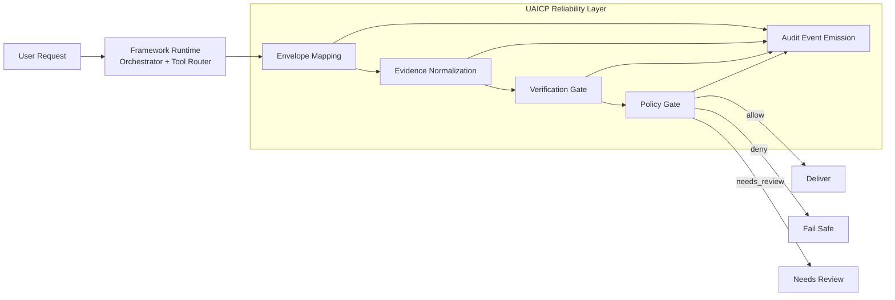
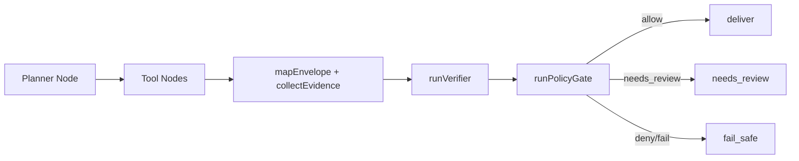
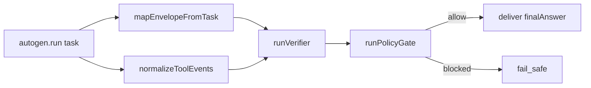
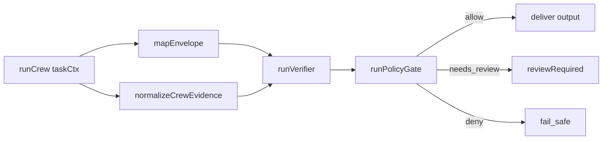
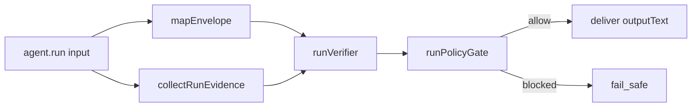

# Architecture Diagrams

This page provides visual references for UAICP protocol architecture, cross-framework terminology mapping, and framework-specific integration patterns.

## 1. Generic UAICP Architecture

## 2. Terminology Mapping Across Frameworks

```mermaid
flowchart TD
    subgraph UAICP[UAICP Primitives]
      U1[Envelope]
      U2[Evidence]
      U3[Verification]
      U4[Policy Gate]
      U5[Audit]
    end

    subgraph LG[LangGraph-style]
      L1[Graph State]
      L2[Node Outputs]
      L3[Verify Node]
      L4[Approval Node]
      L5[Terminal Transition]
    end

    subgraph AG[AutoGen]
      A1[Task Context]
      A2[Tool Events]
      A3[Validation Step]
      A4[Approval Metadata]
      A5[Final Answer Stage]
    end

    subgraph CW[CrewAI]
      C1[Task Context]
      C2[Crew Step Artifacts]
      C3[Completion Check]
      C4[Risk + Approval Check]
      C5[Output Finalization]
    end

    subgraph OA[OpenAI Agents SDK]
      O1[Run Input]
      O2[Tool Calls + Messages]
      O3[Verifier Call]
      O4[Write-Risk Gate]
      O5[Output Publish]
    end

    L1 --> U1
    L2 --> U2
    L3 --> U3
    L4 --> U4
    L5 --> U5

    A1 --> U1
    A2 --> U2
    A3 --> U3
    A4 --> U4
    A5 --> U5

    C1 --> U1
    C2 --> U2
    C3 --> U3
    C4 --> U4
    C5 --> U5

    O1 --> U1
    O2 --> U2
    O3 --> U3
    O4 --> U4
    O5 --> U5
```

## 3. Framework-Specific Flow Patterns

### LangGraph-Style Runtime

### AutoGen Runtime

### CrewAI Runtime

### OpenAI Agents SDK Runtime

